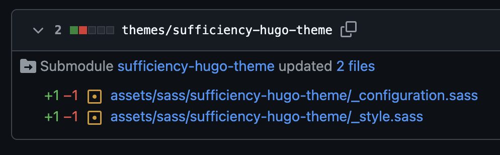

# Osuny

[Documentation officielle sur developers.osuny.org](https://developers.osuny.org)

This project is tested with BrowserStack.

## Run Locally

Clone the project

```bash
  git clone git@github.com:osunyorg/sufficiencylab-site.git --recurse-submodules
```

Go to the project directory

```bash
  cd sufficiencylab-site
```

Install dependencies

```bash
  yarn install
```

Start the server

```bash
  yarn osuny dev
```

Visit: http://localhost:1313/

## Contributing

Contributions are always welcome!

This project uses the open-source static site generator [hugo](https://gohugo.io/) with the [Osuny's theme](https://github.com/osunyorg/theme).

This project has its own theme, [Sufficiency Theme](https://github.com/osunyorg/sufficiency-theme), to personalize the Osuny theme. It follows the instructions of the [Osuny Documentation to Develop](https://developers.osuny.org/docs/website/) (in French).

In order to change the theme you have to modify the Suffiency Theme, merge the changes then locally in this repository run:

```bash
  git submodule update --remote themes/sufficiency-hugo-theme
```

Then commit the change and in the Pull Request it will automatically detail what files were changed like this:



If you want to learn more about how it works you can read the Git Documentation on [Submodules](https://git-scm.com/book/en/v2/Git-Tools-Submodules).
